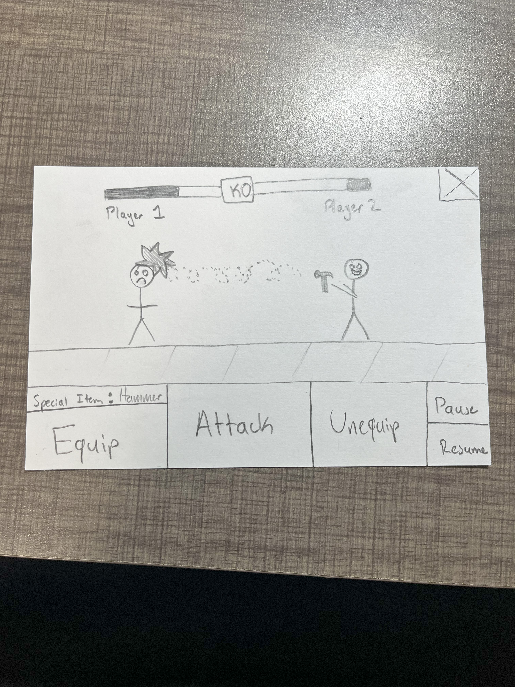

:warning: Everything between << >> needs to be replaced (remove << >> after replacing)

# << Project Title >>
## CS110 Final Project  Spring 2023

## Team Members

Tevin Flom 

***

## Project Description

This is an object-detection based Street-Fighter style game that uses household items to attack in the game. This is a two player arcade-style game with player controls on either side of a standard keyboard. The game will include a dataset of real-life objects the game can detect and deploy, but users should find items in their surroundings to use in the game. The first player to lose all of their health points loses the game. 

***    

## GUI Design

### Initial Design

### Final Design

## Program Design

### Features

1. Start menu
2. Image File Upload/Webcam Access for object detection
3. Object Selection Menu
4. Powerup Sprites with Animations 
5. Health status bars 

### Classes

- Controller - contains the game loop and some global variables & imports for now 
- Player - the game physics for players as well as attacks are here 
- Detections - contains the YOLO object detection model and its predictions as well as the objects they translate to in the game. This will likely have to become several different classes to align with the structure of the YOLO model (ie. foods, utensils, kitchen appliances, etc. )

## ATP

| Step                 |Procedure             |Expected Results                   |
|----------------------|:--------------------:|----------------------------------:|
|  1                   | Run Counter Program  |GUI window appears with count = 0  |
|  2                   | click count button   | display changes to count = 1      |
etc...
